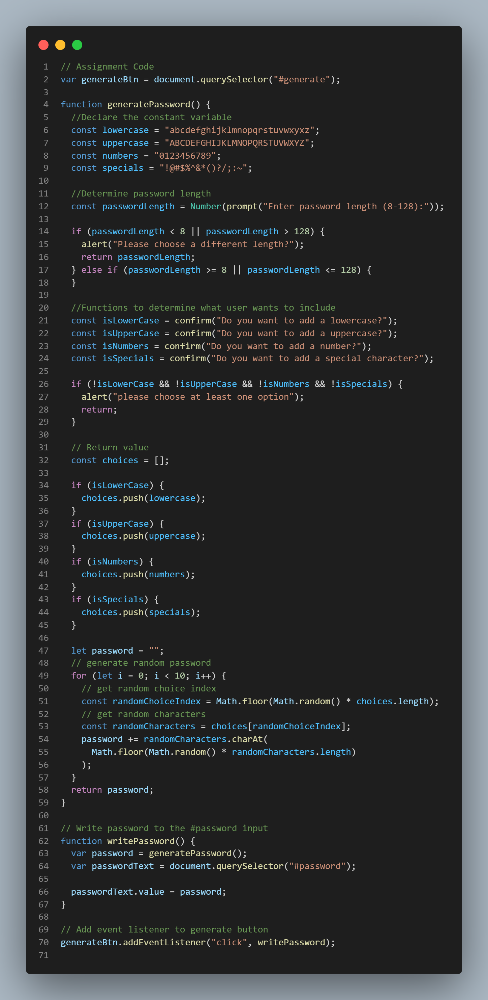

# JavaScript Password Generator 

## Overview

For this project my aim was to modify a starter code given to me which enables employees to generate random passwords based on the criteria that they had selected.

Deployed Link: https://asmaamusse.github.io/password-generator/

GitHub page:https://github.com/AsmaaMusse/password-generator

### What did i do?

- I created a website which generates secure passwords.
- I made the password length to be from 8 characters to 128 characters.
- The user has the option of where or not they would like to add a lowercase, uppercase,number and/or special character.
- I ensured that the generated password matches the criteria selected by the user.

### Technologies used:

-JavaScript

## Screenshots:

JS Code:

## Contribute

To contribute or ask questions, please <a href="https://mail.google.com/mail/u/0/?tf=cm&to=asmaamusse03@gmail.com&cc&bcc&su&body&fs=1">Email</a> here
